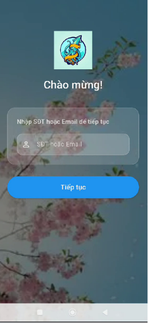
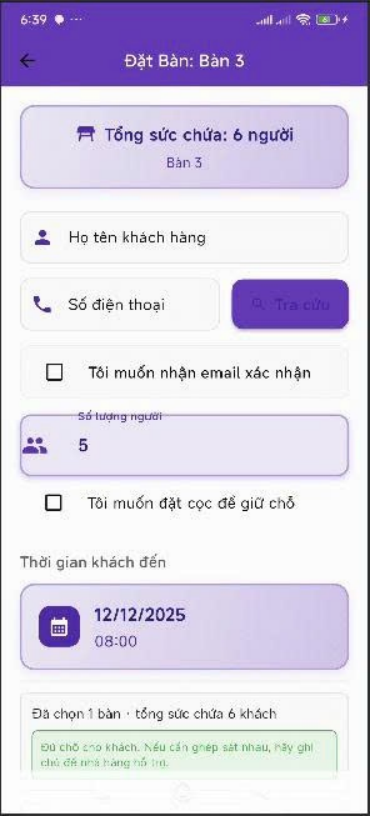
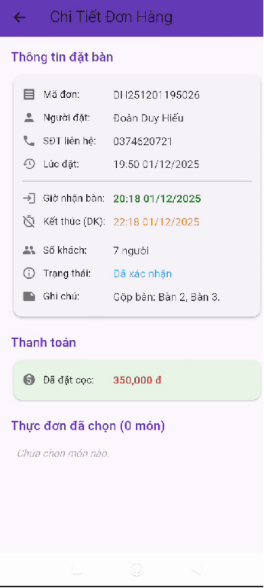
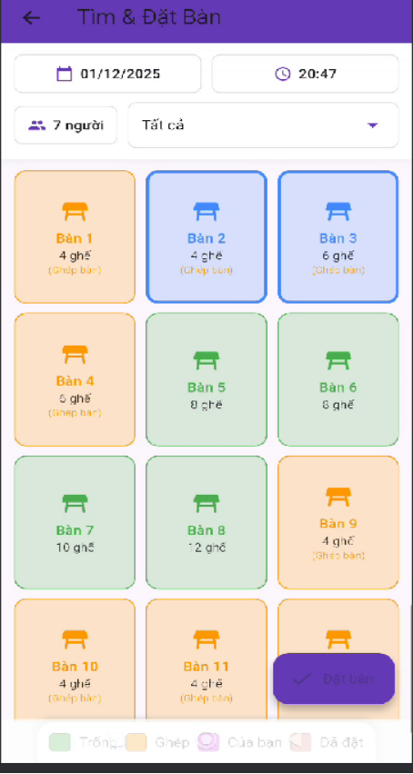

<div align="center">
  

  <h1 align="center">Restaurant Customer App</h1>

  <p align="center">
    <b>Your Pocket Dining Companion</b>
    <br />
    A seamless mobile application designed for customers to reserve tables, browse menus, and manage bookings effortlessly.
    <br />
    <br />
    
    
    
    
  </p>
</div>

---

<details>
  <summary>📚 <b>Table of Contents</b></summary>
  <ol>
    <li><a href="#-introduction">Introduction</a></li>
    <li><a href="#-key-features">Key Features</a></li>
    <li><a href="#-ui-showcase">UI Showcase</a></li>
    <li><a href="#-getting-started">Getting Started</a></li>
    <li><a href="#-project-structure">Project Structure</a></li>
    <li><a href="#-authors">Authors</a></li>
    <li><a href="#-license">License</a></li>
  </ol>
</details>

---

## 🔭 Introduction

**Restaurant Customer App** is a cross-platform mobile application built with **Flutter**. It serves as the direct bridge between the restaurant and the diners.

Instead of calling or visiting in person, customers can proactively **book tables**, view **reservation history**, and explore the **digital E-Menu** directly from their smartphones. The app ensures a smooth experience on both **Android** and **iOS**.

---

## ✨ Key Features

### 📅 Smart Reservation
* **Booking Interface:** Intuitive UI for selecting dates, time slots, and specific tables.
* **Special Requests:** Users can add notes (e.g., "High chair needed", "Birthday decoration") during booking.

### 📜 Activity History
* **Status Tracking:** Real-time updates on booking status (`Pending` ➝ `Confirmed` ➝ `Completed` or `Cancelled`).
* **Details View:** Review past reservations and order details.

### 🍱 Digital E-Menu
* **Visual Menu:** Browse food categories with high-quality images.
* **Item Details:** View prices, ingredients, and descriptions before arriving at the restaurant.

---

## 📸 UI Showcase

| **Home Screen** | **Booking Flow** | **Reservation History** | **Food Details** |
|:---:|:---:|:---:|:---:|
|  |  |  |  |

> *The interface is designed with a focus on User Experience (UX) and modern aesthetics.*

---

## 🚀 Getting Started

Follow these instructions to get a copy of the project up and running on your local machine for development and testing purposes.

### Prerequisites

* [Flutter SDK](https://docs.flutter.dev/get-started/install) (Latest stable version recommended).
* **VS Code** or **Android Studio**.
* **Android Emulator** or **iOS Simulator**.

### Installation Steps

**Transfer ip to localhost**

Connect via USB and run this command to map localhost to the mobile device (reverse tcp).

  ```bash
  adb reverse tcp:5555 tcp:5555
  ```


1.  **Clone the repository**
    ```bash
    git clone [https://github.com/DuyHieu2004/Mobile_QuanLyNhaHang.git](https://github.com/DuyHieu2004/Mobile_QuanLyNhaHang.git)
    cd Mobile_QuanLyNhaHang
    ```

2.  **Install Dependencies**
    Run this command to download all required packages listed in `pubspec.yaml`:
    ```bash
    flutter pub get
    ```

3.  **Check Environment**
    Ensure everything is set up correctly:
    ```bash
    flutter doctor
    ```

4.  **Run the App**
    Connect your device or start an emulator, then run:
    ```bash
    flutter run
    ```

---

## 📂 Project Structure

This project follows a clean architecture approach (MVC/MVVM).

```text
lib/
├── 📂 assets/          # Images, icons, and fonts
├── 📂 data/            # Data sources (API services, local storage)
├── 📂 models/          # Dart Data Models (User, Food, Booking...)
├── 📂 screens/         # UI Screens (Home, Login, Reservation...)
├── 📂 widgets/         # Reusable widgets (CustomButtons, InputFields...)
├── 📂 utils/           # Helper functions and constants (Colors, Styles)
└── 📜 main.dart        # Application entry point
```

---

## 👥 Authors

* **vothaihien** - [GitHub Profile](https://github.com/vothaihien)
* **DuyHieu2004** (Đoàn Duy Hiếu) - [GitHub Profile](https://github.com/DuyHieu2004)

See also the list of [contributors](https://github.com/DuyHieu2004/Mobile_QuanLyNhaHang/contributors) who participated in this project.

---

## 📝 License

This project is licensed under the MIT License - see the [LICENSE](LICENSE) file for details.
